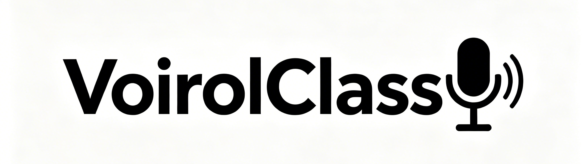

<div align="center">
  

  # VoirolClass

  **A voice-controlled classroom assistant for teachers. Speak naturally to control slides, screens, volume, and applications — hands-free.**

  [](https://www.python.org/)
  [](LICENSE)
  [](https://www.microsoft.com/windows)
  [](https://github.com/ChidcGithub/VoirolClass/releases)
  [](https://github.com/ChidcGithub/VoirolClass/actions)
  [-informational?style=flat-square)](https://github.com/modelscope/FunASR)
  [](https://github.com/BlueSpaceX/speakeronnx)
  [](voirol/agent/)
  [](voirol/tts/)
  [](https://github.com/ChidcGithub/VoirolClass/pulls)
  [](README_zh.md)

  [Features](#features) • [Quick Start](#quick-start) • [Architecture](#architecture) • [Commands](#supported-commands) • [Configuration](#configuration) • [Project Structure](#project-structure) • [Tech Stack](#tech-stack)

</div>

> [!TIP]
> UI/UX collaborators are welcome! If you'd like to help improve the interface, feel free to open an issue or PR. See [CONTRIBUTING.md](CONTRIBUTING.md) for contribution guidelines.

## Features

| Feature | Description |
|---------|-------------|
| **Voice Activity Detection** | Silero VAD ONNX with configurable thresholds and a ring buffer that preserves audio history to avoid cutting off sentence starts |
| **Offline ASR** | SenseVoiceSmall via pure ONNX Runtime — no cloud dependency, runs on CPU |
| **Speaker Verification** | CAM++ embedding (192-dim) via `speakeronnx`. Each teacher enrolls by reading 3–5 sentences; only their voice passes the similarity threshold |
| **Command Matching** | Three-tier strategy: exact → keyword (substring) → fuzzy (SequenceMatcher), with optional AI semantic fallback via DeepSeek / OpenAI |
| **AI Agent** | LLM-powered agent with screen OCR, mouse/keyboard control, file search, app launching, and multi-step task execution |
| **Text-to-Speech** | Local Moss TTS Nano server for Chinese voice output |
| **Push-to-Talk & Voice Wake** | Global hotkey `Ctrl+Alt+V` or pure VAD-based wake |
| **Multi-Teacher Profiles** | Register, select, and delete voice profiles at runtime |
| **i18n** | English and Chinese UI, switchable at runtime |

## Quick Start

```bash
pip install -r requirements.txt
python main.py
```

Right-click the tray icon → **Settings...** → register a teacher. Start speaking: "Next Page", "Mute", "Open Baidu".

<details>
<summary><b>Detailed installation</b></summary>

```bash
git clone https://github.com/ChidcGithub/VoirolClass.git
cd VoirolClass
python -m venv .venv
.venv\Scripts\activate
pip install -r requirements.txt
```

Edit `config.toml` to set your language and microphone device, then run:

```bash
python main.py
```

The first run will download required models automatically.

</details>

## Architecture

```
Microphone ─► AudioCapture ─► SileroVAD ─► SpeakerVerifier ─► ASR ─► CommandMatcher ─► Action
                                                                        │
                                                                 └─ AIMatcher (AI fallback)
                                                                        │
                                                                 └─ AgentEngine (multi-step)
```

1. **AudioCapture** reads 16 kHz PCM blocks from the microphone
2. **SileroVAD** runs an ONNX neural network to detect speech segments
3. **SpeakerVerifier** extracts a CAM++ embedding and compares it to the enrolled teacher's profile
4. **ASR** (SenseVoice) transcribes the verified speech segment to text
5. **CommandMatcher** finds the best-matching command (exact → keyword → fuzzy)
6. **AIMatcher** (optional) falls back to an LLM for semantic command matching
7. **AgentEngine** (optional) handles complex multi-step tasks with screen OCR and computer control
8. **Action** executes the command — keyboard shortcut, system call, or UI action

All components are wired together by `VoicePipeline` in `voirol/core/pipeline.py`.

## Supported Commands

| Category | Commands | Action |
|----------|----------|--------|
| Slide control | `next_page`, `prev_page` | `→` / `←` |
| Display | `black_screen`, `white_screen` | Monitor off / fullscreen white |
| Application | `open_whiteboard`, `open_browser`, `open_file`, `open` (with AI routing) | Launch apps and files |
| Audio | `volume_up`, `volume_down`, `mute` | System volume ±5, toggle mute |
| View | `fullscreen`, `esc` | `F11`, `Esc` |
| Input | `enter`, `space` | `Enter`, `Space` |
| AI Agent | `电脑操作` `帮我找到...` `screen` | Multi-step task execution |

Each command has Chinese keyword aliases (e.g. `下一页` / `下一张` for `next_page`).

## Configuration

Key settings in `config.toml`:

| Section | Key | Default | Description |
|---------|-----|---------|-------------|
| `[general]` | `language` | `en` | UI language (`en` / `zh`) |
| `[vad]` | `threshold` | `0.25` | Speech probability threshold |
| | `silence_duration` | `1.0` | Seconds of silence to end utterance |
| `[voice]` | `verification_threshold` | `0.45` | Similarity threshold for speaker match |
| `[asr]` | `engine` | `sensevoice` | `sensevoice`, `baidu`, `azure`, or `tencent` |
| `[commands]` | `match_mode` | `fuzzy` | `exact` / `keyword` / `fuzzy` |
| | `fuzzy_threshold` | `0.8` | SequenceMatcher ratio |
| `[hotkey]` | `push_to_talk` | `ctrl+alt+v` | PTT hotkey |
| `[ai]` | `enabled` | `false` | Enable AI fallback matching |
| | `api_url` | `https://api.deepseek.com/v1` | OpenAI-compatible API endpoint |
| | `model` | `deepseek-chat` | LLM model name |
| `[agent]` | `enabled` | `false` | Enable AI agent for multi-step tasks |
| | `max_steps` | `30` | Max execution steps per task |
| `[tts]` | `enabled` | `false` | Enable text-to-speech output |

See `config.toml.example` for the full configuration reference.

## Project Structure

```
voirol/
├── ai/             # LLM integration (OpenAI-compatible API client, semantic matcher)
├── agent/          # AI agent (screen OCR, mouse/keyboard control, file ops, task execution)
├── asr/            # Speech recognition (SenseVoice, Baidu, Azure, Tencent)
├── audio/          # Audio capture, VAD, preprocessing
├── command/        # Command registry, matcher, actions (file open, browser, volume, etc.)
├── core/           # Config loader & VoicePipeline (audio → command orchestrator)
├── gui/            # PyQt6: system tray, settings dialog, splash screen, floating capsule
├── tts/            # Text-to-speech (Moss TTS Nano)
├── utils/          # i18n, logging, HTTP download, resources
└── voice/          # Speaker verification & enrollment (CAM++, profile management)
```

## Tech Stack

| Component | Library | Notes |
|-----------|---------|-------|
| GUI | PyQt6 | System tray, settings dialog, OpenGL indicator |
| Audio capture | sounddevice | Callback-based 16 kHz PCM stream |
| VAD | Silero VAD ONNX | via onnxruntime |
| ASR | SenseVoiceSmall ONNX | Fully offline, CPU |
| Speaker verification | speakeronnx | CAM++, 192-dim embeddings |
| Command execution | pyautogui | Keyboard & mouse simulation |
| AI/LLM | OpenAI-compatible API | DeepSeek, OpenAI, or any OpenAI-compatible provider |
| OCR | pytesseract | Screen text extraction for agent |
| Hotkeys | keyboard | Global hotkey registration |
| i18n | Custom dictionary | English & Chinese built-in |

## Open Source Libraries

VoirolClass relies on these open source projects. We are grateful for their work.

| Library | License | Description |
|---------|---------|-------------|
| [PyQt6](https://www.riverbankcomputing.com/software/pyqt/) | GPL v3 | Cross-platform GUI framework |
| [sounddevice](https://python-sounddevice.readthedocs.io/) | MIT | Audio capture and playback |
| [soundfile](https://python-soundfile.readthedocs.io/) | BSD-3-Clause | Audio file I/O |
| [onnxruntime](https://github.com/microsoft/onnxruntime) | MIT | Cross-platform ML inference engine |
| [Silero VAD](https://github.com/snakers4/silero-vad) | MIT | Voice activity detection |
| [SenseVoice](https://github.com/modelscope/FunASR) | MIT | Speech recognition engine |
| [CAM++ / speakeronnx](https://github.com/BlueSpaceX/speakeronnx) | Apache 2.0 | Speaker verification |
| [pyautogui](https://github.com/asweigart/pyautogui) | BSD-3-Clause | Keyboard & mouse automation |
| [pytesseract](https://github.com/madmaze/pytesseract) | Apache 2.0 | OCR engine wrapper |
| [Tesseract OCR](https://github.com/tesseract-ocr/tesseract) | Apache 2.0 | OCR engine |
| [Pillow](https://python-pillow.org/) | Historical | Image processing |
| [keyboard](https://github.com/boppreh/keyboard) | MIT | Global hotkey hooks |
| [scipy](https://scipy.org/) | BSD-3-Clause | Signal processing |
| [numpy](https://numpy.org/) | BSD-3-Clause | Numerical computation |
| [requests](https://requests.readthedocs.io/) | Apache 2.0 | HTTP client |
| [toml](https://github.com/uiri/toml) | MIT | TOML config parser |
| [MOSS TTS Nano](https://github.com/OpenMOSS/MOSS-TTS-Nano) | Apache 2.0 | Text-to-speech engine |
